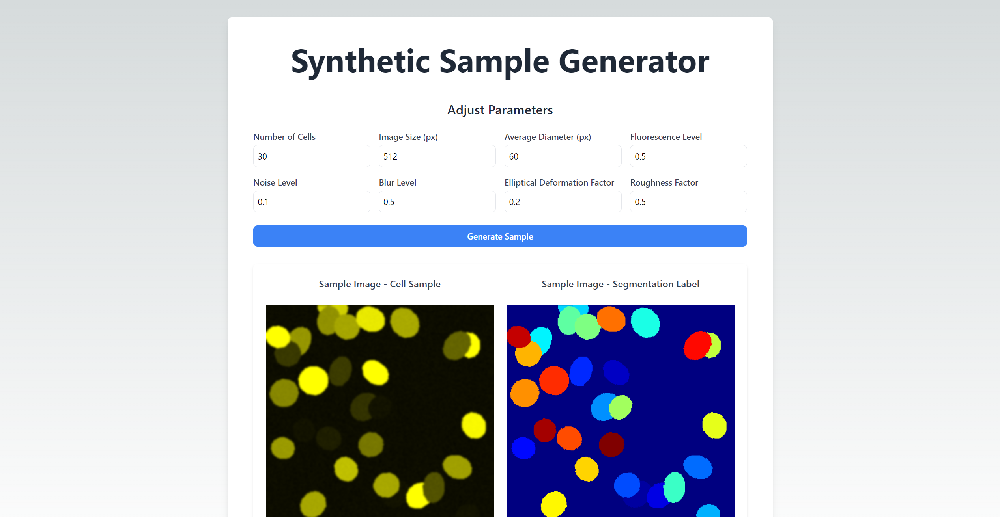

# Synthetic Sample Generator

## Project Overview

This web application allows researchers to adjust various parameters to generate synthetic samples. These parameters can be used to generate a dataset of input images and ground truth labels for training image segmentation models like Mask R-CNN. The scripts to generate the dataset based on parameter ranges are present in the `dataset_generation` directory.

The website is deployed and can be accessed here [http://ec2-3-143-215-48.us-east-2.compute.amazonaws.com/](http://ec2-3-143-215-48.us-east-2.compute.amazonaws.com/).

### Adjustable Parameters

Below is a table of the parameters that can be adjusted via the web interface:

| Parameter                     | Description                                                                                       |
| ----------------------------- | ------------------------------------------------------------------------------------------------- |
| Number of Cells               | Specifies the total number of cells within the sample.                                            |
| Image Size (px)               | Defines the dimensions of the image in pixels.                                                    |
| Average Diameter (px)         | Sets the average diameter of each cell in pixels.                                                 |
| Fluorescence Level            | Adjusts the fluorescence intensity of pixels within the cells.                                    |
| Noise Level                   | Controls the intensity of Gaussian noise applied to the image.                                    |
| Blur Level                    | Controls the intensity of Gaussian blur applied to the image.                                     |
| Elliptical Deformation Factor | Modifies the elliptical shape of the cells, affecting the ratio of axis lengths.                  |
| Roughness Factor              | Alters the roughness of the cellular boundaries, impacting how jagged or smooth the edges appear. |

## Future Enhancements

Given more time, there are several improvements that could be made to the application:

1. **Overlap Control**: Currently, cell placement is random without considering the positions of already existing cells. Implementing overlap control could prevent unrealistic cell clustering.
2. **Realistic Noise and Blur Patterns**: Improve the realism by moving beyond a simple Gaussian model for noise and blur patterns.

3. **Cell-Wise Blur Patterns**: Although it's unclear why different cells would exhibit different blur patterns given the same distance from the camera or microscope lens, observed sample data shows variability in cell blurring.

## My Feelings

I feel that the current algorithm does a reasonable job in creating samples similar to that in the provided document. However, I believe there was potential to achieve better results if more sample data were available to mimic the distribution of different parameters in the synthetic dataset. Additionally, there is some scope for tuning how adjustments to the parameters affect the resulting image. Currently, it takes significant manual effort to adjust parameters to achieve realistic images. These parameters could be more constrained and tied to each other to consistently produce reasonably realistic images.
